# AWS Backup Implementation for EC2 and RDS

## Project Overview

This project demonstrates how to implement a **centralized backup strategy using AWS Backup** to protect critical AWS resources such as **EC2 instances and RDS databases**.

A sample infrastructure was created consisting of an **EC2 web server and an RDS MySQL database**. A **Backup Vault and Backup Plan** were configured using AWS Backup to automate the backup process and store recovery points.

The project validates the backup configuration by triggering **on-demand backups** and verifying that recovery points are successfully created.

---

# Architecture Diagram

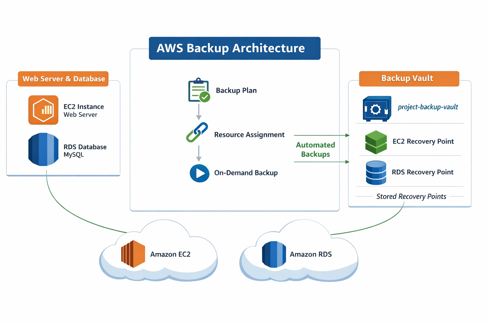

---

# AWS Services Used

* Amazon EC2
* Amazon RDS (MySQL)
* AWS Backup
* AWS IAM
* Amazon VPC
* Security Groups

---

# Infrastructure Setup

## EC2 Instance

An EC2 instance was launched using **Amazon Linux** and configured with an **Apache web server** to host a sample webpage.

### Features

* Instance Type: t2.micro
* Web Server: Apache
* Region: ap-south-1
* Public Web Access Enabled

### Screenshot

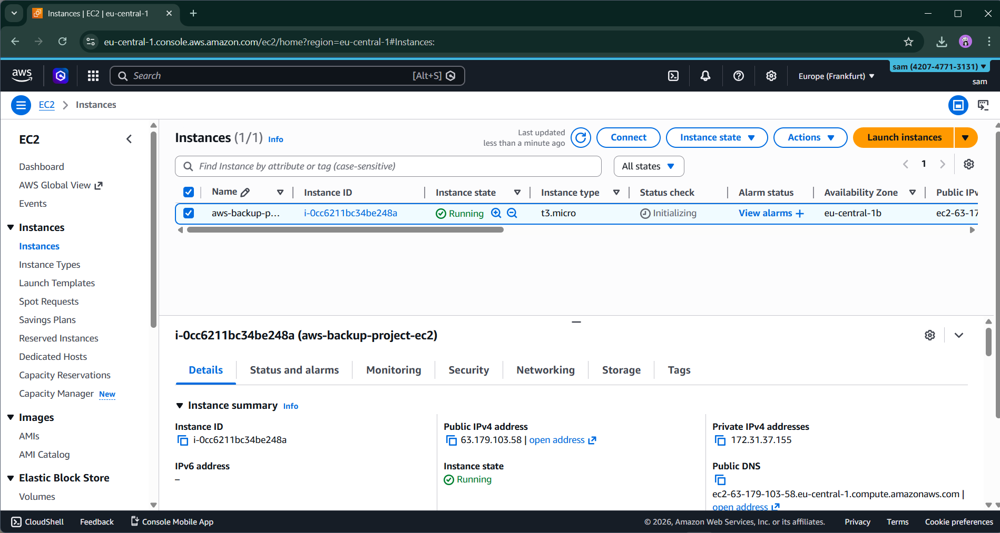

---

## Apache Web Server Status

The Apache HTTP server was installed and started on the EC2 instance to host the sample application page.

### Command Used

```
sudo systemctl status httpd
```

### Screenshot

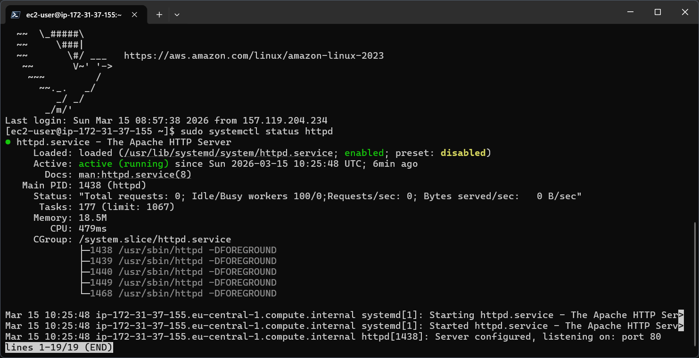

---

## Web Server Page

A sample webpage was created to simulate application data stored on the EC2 instance.

### Screenshot

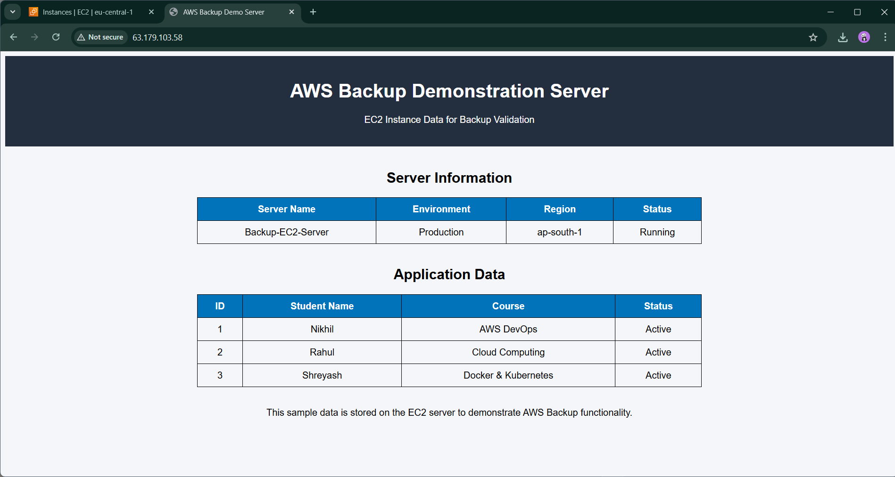

---

# RDS Database Setup

An **Amazon RDS MySQL database** was created to store structured application data.

### Configuration

* Database Engine: MySQL
* Instance Type: db.t3.micro
* Public Access: Enabled
* Database Name: backupdemo

### Screenshot

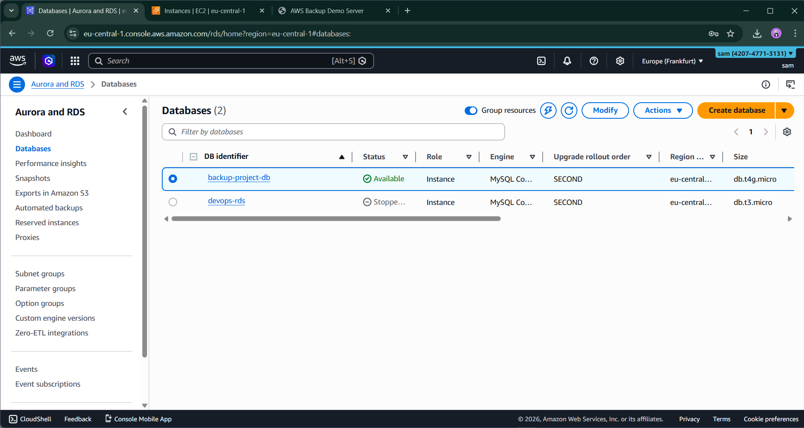

---

## Sample Database Table

A sample table called **students** was created to store records.

Example query:

```
SELECT * FROM students;
```

### Screenshot

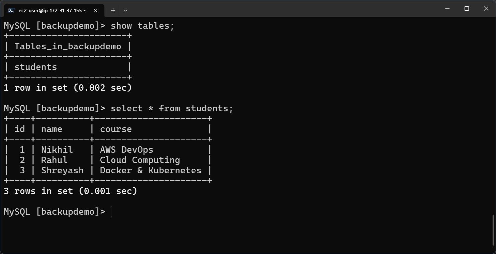

---

# AWS Backup Configuration

AWS Backup was configured to create automated backups for both EC2 and RDS resources.

---

## Backup Vault

A backup vault was created to securely store backup recovery points.

Vault Name:

```
project-backup-vault
```

### Screenshot

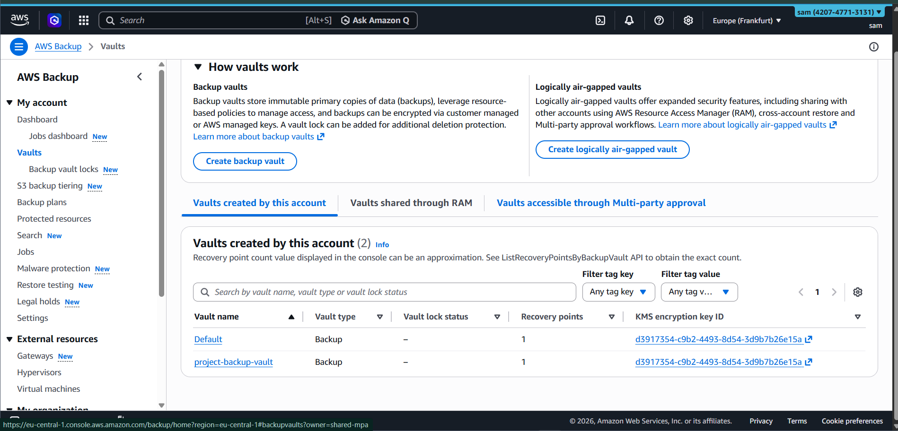

---

## Backup Plan

A backup plan was configured with a **daily backup rule** and defined retention settings.

### Configuration

Backup Plan Name:

```
ec2-rds-backup-plan
```

Backup Frequency:

```
Daily
```

Retention Period:

```
35 days
```

### Screenshot

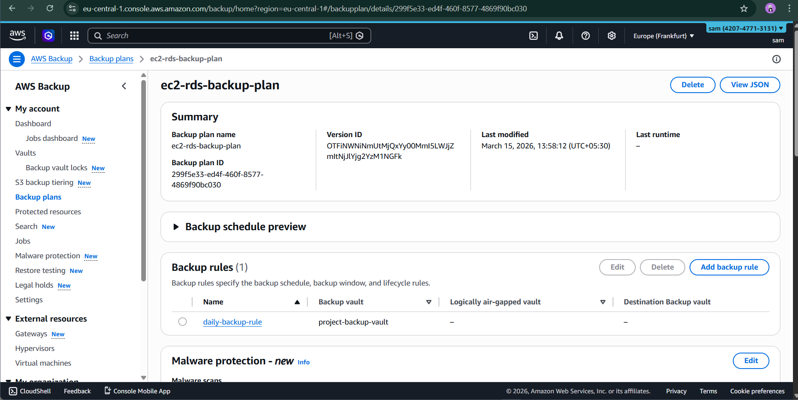

---

# Resource Assignment

The backup plan was assigned to the following resources:

* EC2 instance
* RDS database

This allows AWS Backup to automatically create backups for these resources.

### Screenshot

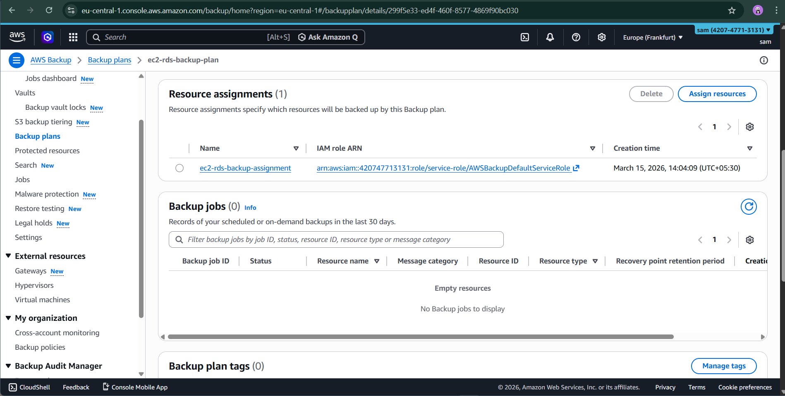

---

# Protected Resources

Once the backup plan was applied, the EC2 instance and RDS database appeared under **Protected Resources** in AWS Backup.

### Screenshot

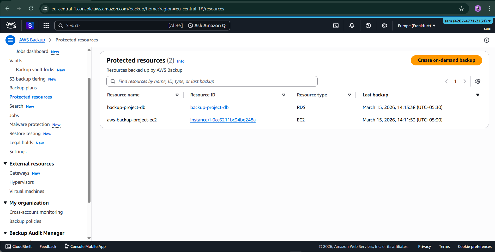

---

# Backup Validation

On-demand backups were triggered to test the backup configuration.

Backup jobs were monitored through the AWS Backup console.

### Screenshot

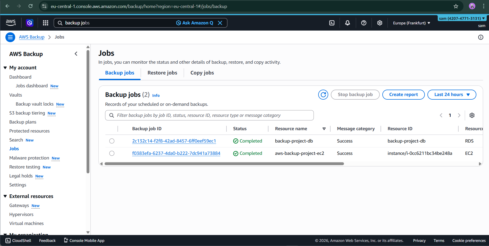

---

# Recovery Points Verification

After successful backup execution, recovery points were created and stored in the backup vault.

These recovery points can be used to restore EC2 instances or RDS databases in case of failure or data loss.

### Screenshot

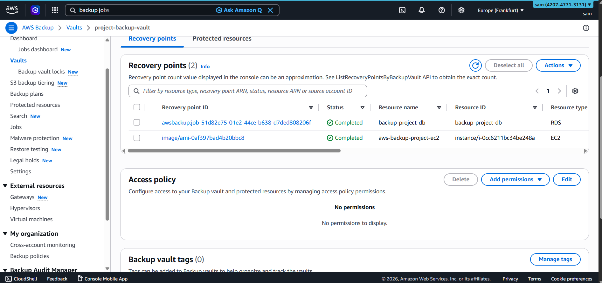

---

# Project Outcome

This project successfully demonstrates:

* Deployment of EC2 web server
* Deployment of RDS MySQL database
* Implementation of AWS Backup Vault
* Creation of automated backup plans
* Assignment of resources for backup
* Execution of on-demand backups
* Verification of recovery points

---

# Conclusion

AWS Backup provides a **centralized and automated solution for protecting AWS workloads**. By implementing backup plans and recovery points, organizations can ensure **data durability, disaster recovery readiness, and operational continuity**.

This project illustrates how AWS Backup can be effectively used to protect EC2 and RDS resources in a real-world cloud environment.

---

# Author

**Nikhil Khandare**

